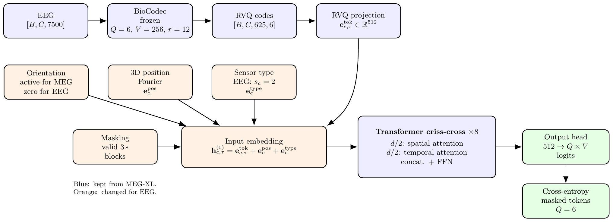
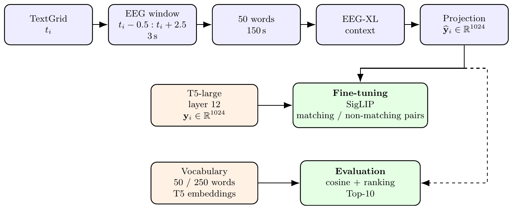
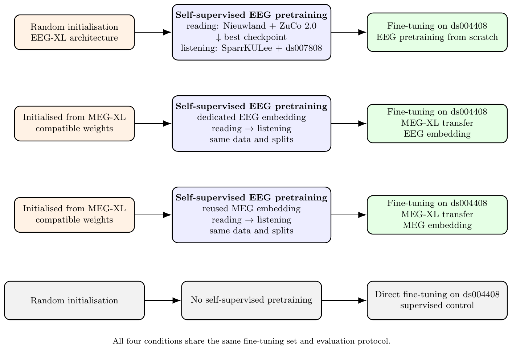
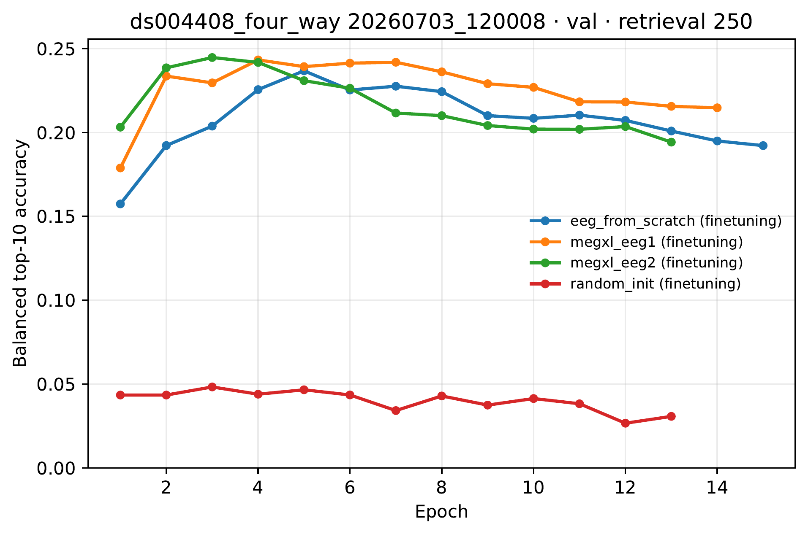
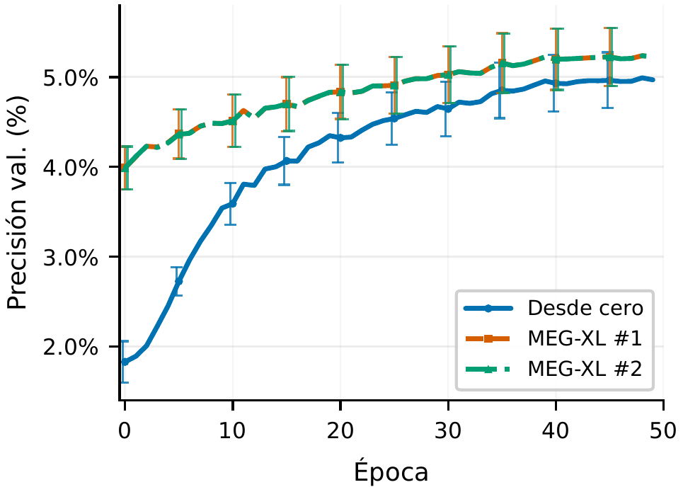
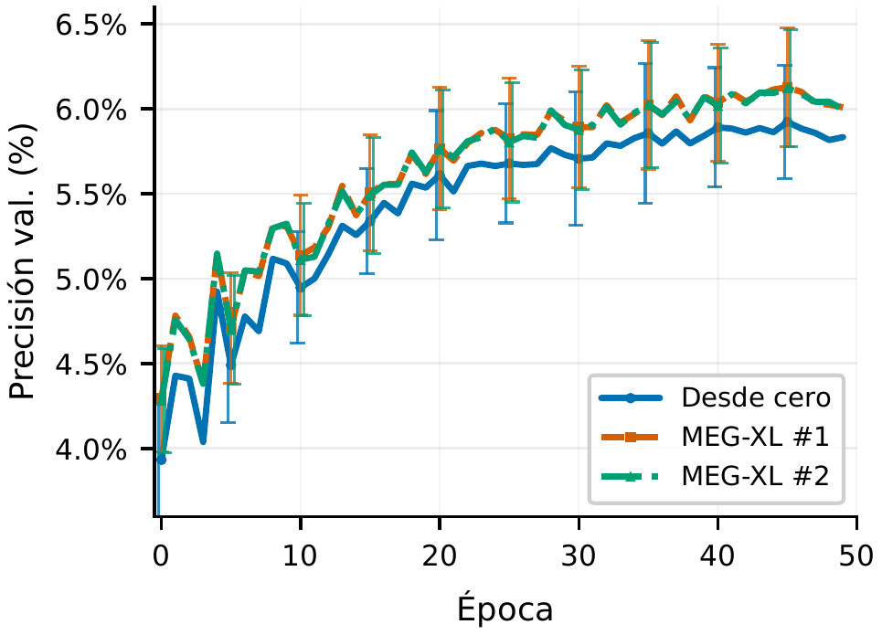

# EEG-XL

**Transferring long-context MEG models to EEG for word classification in natural reading and listening.**

Code for the Master's thesis *"Transferencia de modelos MEG de contexto largo a EEG para clasificación de palabras en lectura natural"* (Ricardo Díaz, Universitat Politècnica de València, 2026). Full text (in Spanish): [`memoria/tfm.pdf`](memoria/tfm.pdf).

EEG-XL adapts [MEG-XL](https://arxiv.org/abs/2602.02494), a self-supervised model that learns from 150-second windows of continuous MEG, to heterogeneous EEG recordings. The model is pretrained on continuous EEG (reading, then listening) and evaluated on contextual word retrieval on OpenNeuro ds004408.

**Main result:** 22.32 % balanced top-10 accuracy over the 250 most frequent words on the ds004408 test split (chance: 4 %).

## Architecture

*Blue: kept from MEG-XL. Orange: changed for EEG. Green: self-supervised objective.*

The backbone, tokenizer and objective stay as close as possible to MEG-XL; the changes are concentrated in the EEG input.

- **Input.** 150 s windows, band-pass filtered at 0.1–40 Hz and resampled to 50 Hz (7500 samples per channel; effective band ≈ 0.1–25 Hz after resampling).
- **Tokenizer.** A frozen [BioCodec](https://github.com/klean2050/BioCodec-release) encodes each channel independently with residual vector quantization: 6 quantizers, 256 codes each, temporal reduction factor 12 (7500 samples → 625 tokens).
- **Input embedding.** Each token is the sum of the projected RVQ codes, a Gaussian Fourier embedding of the electrode's 3D position, and a learned sensor-type embedding (gradiometer / magnetometer / EEG). The MEG coil-orientation term is zeroed for EEG.
- **Heterogeneous montages.** Datasets with 64, 105, 128 or variable channel counts share one channel dimension; absent channels are masked in both attention and loss, with no spatial interpolation.
- **Encoder.** 8 criss-cross Transformer layers (8 heads, latent size 512). Half of the latent dimension attends across sensors at the same time step, the other half across time within a sensor.
- **Objective.** Masked token prediction: 20 of the 50 three-second blocks are masked across all real channels, and the model predicts the BioCodec codes with cross-entropy averaged over the 6 quantizers.

| Component | Type | Parameters |
|---|---|---:|
| `tokenizer` | `BioCodecTokenizerAdapter` (frozen) | 3.2 M |
| `rvq_projector` | `Linear` | 49.7 K |
| `position_fourier_emb` | `GaussianFourierEmb3D` | 375 |
| `position_projector` | `Linear` | 128 K |
| `orientation_fourier_emb` | `GaussianFourierEmb3D` | 375 |
| `orientation_projector` | `Linear` | 128 K |
| `sensor_type_layer` | `Embedding` | 1.5 K |
| `criss_cross_transformer` | `SpatialTemporalEncoder` | 21.0 M |
| `output_head` | `Linear` | 787 K |
| **Trainable** | | **22.1 M** |
| **Total** | | **25.3 M** |

### Word-level fine-tuning

For each word in ds004408, a 3 s EEG window is taken from 0.5 s before to 2.5 s after word onset; 50 consecutive words form one 150 s input. The encoder output for each word is averaged over time, flattened and projected by a two-layer MLP (2048 hidden units) to a 1024-dimensional vector. Targets are layer-12 embeddings from T5-large, trained with a SigLIP-style contrastive loss. At evaluation, predictions are ranked by cosine similarity against the embeddings of the 50 or 250 most frequent words.

### Experimental design

Three pretrained variants follow the same two-stage schedule, reading (Nieuwland et al., ZuCo 2.0) then listening (SparrKULee, OpenNeuro ds007808), and differ only in initialisation and in the sensor-type embedding used for EEG channels. A fourth condition is fine-tuned directly from random initialisation. ds004408 is never seen during pretraining.

## Results

### Word retrieval on OpenNeuro ds004408 (test split)

Top-10 accuracy. "Balanced" is the macro-average over words and is the primary metric. Each row uses the checkpoint with the best balanced top-10 (250 words) on validation.

| Condition | Selected epoch | Top-10, 50 words | Balanced, 50 | Top-10, 250 words | Balanced, 250 | × chance |
|---|:---:|---:|---:|---:|---:|---:|
| No pretraining | 3 | 27.77 % | 20.00 % | 14.66 % | 4.05 % | 1.01 |
| EEG pretraining from scratch | 5 | 64.62 % | 61.63 % | 39.89 % | 19.95 % | 4.99 |
| MEG-XL transfer, EEG embedding | 4 | 63.62 % | 62.50 % | 40.98 % | 20.56 % | 5.14 |
| **MEG-XL transfer, MEG embedding** | 3 | **64.92 %** | **64.19 %** | **42.89 %** | **22.32 %** | **5.58** |
| Uniform chance | – | 20.00 % | 20.00 % | 4.00 % | 4.00 % | – |

Differences between conditions, in percentage points of balanced top-10:

| Comparison | Δ 50 words | Δ 250 words |
|---|---:|---:|
| EEG pretraining: from scratch − no pretraining | +41.63 | +15.90 |
| MEG-XL transfer: EEG embedding − from scratch | +0.87 | +0.61 |
| Sensor embedding: MEG embedding − EEG embedding | +1.69 | +1.76 |

- Fine-tuning from random initialisation stays at chance on the balanced metric.
- Self-supervised EEG pretraining accounts for most of the gain (4.05 % → 19.95 %).
- Initialising from MEG-XL adds a smaller improvement, and reusing the magnetometer embedding gives the best result in this run.
- The best checkpoints appear early (epochs 3–5); further fine-tuning lowers validation accuracy.

*Validation balanced top-10 accuracy (250 words) during fine-tuning. `random_init`: no pretraining; `eeg_from_scratch`: EEG pretraining from scratch; `megxl_eeg1` / `megxl_eeg2`: the two MEG-XL transfer variants.*

Test-set coverage: the 50-word vocabulary covers 20 045 of 35 150 examples (57.03 %) and the 250-word vocabulary 28 120 (80.00 %).

### Self-supervised pretraining (validation)

Best checkpoint per stage by validation loss; accuracy is the mean masked-token accuracy over the 6 quantizers.

| Condition | Reading epoch | Reading loss | Reading acc. | Listening epoch | Listening loss | Listening acc. |
|---|:---:|---:|---:|:---:|---:|---:|
| EEG pretraining from scratch | 48 | 4.6988 | 4.96 % | 30 | 4.5489 | 5.74 % |
| MEG-XL transfer, EEG embedding | 47 | 4.6688 | 5.22 % | 25 | 4.5340 | 5.74 % |
| MEG-XL transfer, MEG embedding | 47 | 4.6688 | 5.22 % | 25 | 4.5337 | 5.74 % |

| Reading stage | Listening stage |
|:---:|:---:|
|  |  |

*Validation token accuracy per epoch. "Desde cero": from scratch; "MEG-XL #1" / "#2": the two MEG-XL transfer variants (nearly overlapping). Error bars: one standard deviation across the 6 quantizers.*

### Comparison with prior work

Under the same metric (balanced top-10 over the 250 most frequent words), d'Ascoli et al. (2025) report approximately 20 % on ds004408; the best EEG-XL model reaches 22.32 %. Splits and preprocessing are not identical across works and each condition here was run with a single seed (42), so the difference is descriptive rather than a claim of superiority.

## More

- Setup and running the experiments: [`docs/SETUP.md`](docs/SETUP.md) and [`README_REPRODUCIBILIDAD.md`](README_REPRODUCIBILIDAD.md) (Spanish).
- Citation: [`CITATION.cff`](CITATION.cff).
- License: [`LICENSE`](LICENSE); code derived from MEG-XL is covered by [`LICENSE_MEGXL`](LICENSE_MEGXL).
